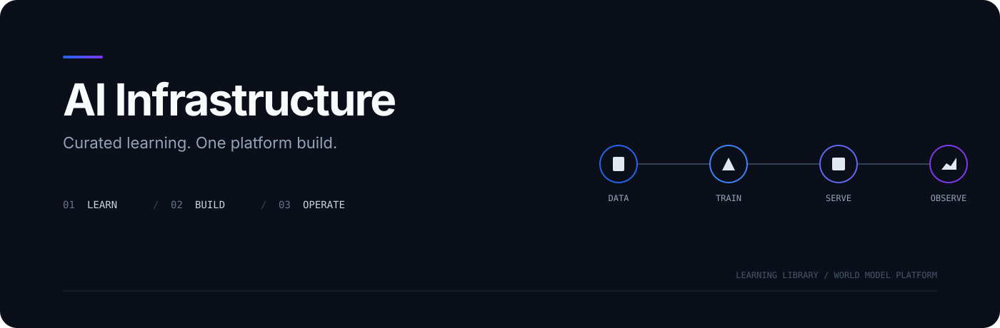
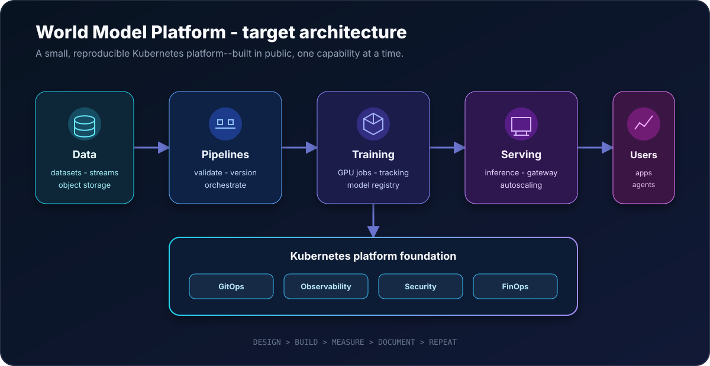

<div align="center">
  

  <h1>AI Infrastructure</h1>

  <p>
    <strong>A growing library of the resources I use to learn AI infrastructure,<br>
    plus one flagship project where I turn that knowledge into a working platform.</strong>
  </p>

  <p>
    <a href="#learning-library"><strong>Learning library</strong></a>
    ·
    <a href="world-model-platform/"><strong>World Model Platform</strong></a>
    ·
    <a href="#current-progress"><strong>Progress</strong></a>
    ·
    <a href="ROADMAP.md"><strong>Roadmap</strong></a>
  </p>

  <p>
    <a href="LICENSE"></a>
    
    
  </p>
</div>

Each learning folder represents an independent course, handbook, repository, or reading list. The [`world-model-platform/`](world-model-platform/) is the only large build and brings the strongest ideas together in one Kubernetes-native system.

## Repository structure

```text
AI-Infrastructure/
├── zero-hero-course/                 # selected introductory labs
├── stanford-cs336-.../               # language modeling from first principles
├── camilo-inference-recommendations/ # curated inference study path
├── world-model-platform/             # the flagship platform project
├── research/                         # researched future learning sources
├── assets/                           # diagrams and artwork
├── ROADMAP.md
├── CONTRIBUTING.md
├── SECURITY.md
└── LICENSE
```

One source gets one top-level folder. New folders appear only when study begins.

## Learning library

### 01. Zero-to-Hero AI Infrastructure

An external introduction to cloud, containers, Kubernetes, GPUs, training, serving, observability, MLOps, and security. Roughly 36 useful labs were retained; repetitive or low-value sessions were skipped.

[Browse the selected labs](zero-hero-course/)

### 02. Stanford CS336: Language Modeling from Scratch

A fundamental systems course covering architecture, resource accounting, GPU optimization, distributed training, scaling, data, evaluation, inference, and post-training. Current focus: Lecture 3, Architectures and Hyperparameters.

[Open the CS336 study folder](stanford-cs336-language-modeling-from-scratch/)

### 03. Camilo's Inference Optimization Resources

A practical path curated by [Camilo (@jcfernandezpr)](https://github.com/jcfernandezpr), from inference arithmetic and memory fundamentals to vLLM benchmarking, GPU kernels, engines, and research papers.

[Open the inference optimization resources](camilo-inference-recommendations/)

## Flagship project

### World Model Platform

A compact Kubernetes-native platform for the full model lifecycle:

```text
collect -> validate -> train -> evaluate -> register -> serve -> observe -> improve
```

The project will cover reproducible infrastructure, data pipelines, GPU training, experiment tracking, serving, observability, security, cost controls, and runbooks.

<div align="center">
  
</div>

This is the target architecture; implementation is still in its foundation phase. [Explore the project](world-model-platform/).

## Current progress

- **Library:** 3 learning sources indexed
- **Active study:** Stanford CS336 Lecture 3
- **Platform:** scope, architecture, and milestones defined

See the [learning radar](research/AI-INFRASTRUCTURE-LEARNING-RADAR.md) for researched future resources and [ROADMAP.md](ROADMAP.md) for active work.

## How to use it

Open any learning folder independently, or follow the World Model Platform to see the concepts combined. Requirements vary, so each source documents its own tools, hardware, cost, verification, and cleanup.

## Attribution and licensing

Learning folders preserve their original authorship and licensing. The repository-level [Apache License 2.0](LICENSE) applies only to my original contributions unless stated otherwise.

Corrections and attribution fixes are welcome. See [CONTRIBUTING.md](CONTRIBUTING.md). Security-sensitive reports should follow [SECURITY.md](SECURITY.md).

<div align="center">
  <sub>Study strong sources. Keep the useful parts. Build one real system.</sub>
</div>
